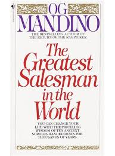

# How living by principles of goodness lead to great things
## This is a fictional story set it the middle east
- This is about camel boy who wanted to become a great trader in the middle east, he soon realised how difficult it was to be a salesman.
- This book uncovers the fact that people will not do business with you unless they trust you, and the principles uncovered in this book, if followed, can be a great benefit to you in your personal and professional life.
## The Scrolls
- **Scroll I - I will Form Good Habits and Become their Slave**
  - In truth experience teaches thoroughly yet her course devours men's lives.  
- **Scroll II - Greet Each Day With Love In Your Heart**
  - Muscle can split a shield and even destroy life but only the unseen power of love can open the hearts of men.
  - How will react to the actions of others? With love. For just as love is my weapon to open the hearts of men, love is also my shield to repulse the arrows of hate and the spears of anger.
- **Scroll III - I Will Persist Until I Succeed**
  - The prizes of life are at the end of each journey, not near the beginning; and it is not given to me to know how many steps are necessary in order to reach my goal.
  - Failure I may still encounter at the thousandth step, yet success hides behind the next bend in the road.
  - Always I can take another step. If that is to no avail I will take another, and yet another. In truth, one step at a time is not too difficult.
  - Henceforth, I will consider each day's effort as but one blow of my blade against the mighty oak.
  - Each blow, of itself,  may be trifling, and seem of no consequence. Yet from childish swipes the oak will eventually tumble.
  - I will be like the rain drop which washes away the mountain; the ant that devours a tiger.
- **Scroll IV - I am Nature's Greatest Miracle**
  - I am not on earth by chance. I am here for a purpose and that purpose is to grow into a mountain, not to shrink to a grain of sand.
  - Nature knows no defeat. Eventually, she emerges victorious and so will I, and with each victory the next struggle becomes less difficult.
- **Scroll V - Live Each Day as if it Were Your Last**
- **Scroll VI - Master Your Emotions**
- **Scroll VII - The Power of Laughter**
- **Scroll VIII - Multiply Your Value Every Day**
- **Scroll IX - All is Worthless Without Action**
- **Scroll X - Pray to God for Guidance**

## Notable quotes (this book is packed with them)
- Failure will never overtake me if my determination to succeed is strong enough.
