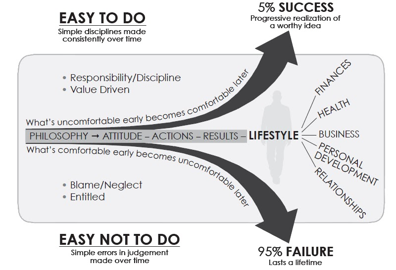

# The Slight Edge

## Seven Principles of The Slight Edge Success

1. **Show up**
2. Be **consistent**
3. Have a good **attitude**
4. Be **committed** for a **long period of time**
5. Have **faith** and a burning **desire**
6. Be willing to **pay the price**
7. Practice Slight Edge **integrity**

### Consistently repeated daily actions + time = unconquerable results
- If it’s so simple, why doesn’t everyone do it?
  - Things that are easy to do are just as easy not to do
  - For the slight edge to work, you have to do something, and keep doing it until you succeed.
  - The results are not immediately visible. The small activities are undramatic and seemingly insignificant.
  
### Harness the Five Sources of Power 

### Success
- Focusing on Philosophy, not Results.
- Continuous Learning.
- Turning your Dreams into Reality.

### Slight Edge Graph

- If we do nothing to improve our situation we are on the bottom curve
  - The slight edge is negative by default
- To get on the top curve it is as easy as 1/3 of 1% improvement EVERY DAY

### The Power of Compound improvement
- Two People decide to invest money (Ben and Arthur) in an investment paying 12%
- Arthur decides to wait 8 years before starting
- Ben stops paying after 8 years
- Arthur has to continously pay $2000 for about 40 years and still does not catch up to Ben's total

