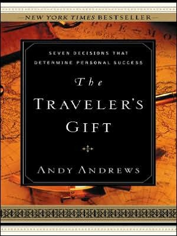

# The Travellers Gift

## Seven Decisions (you must make!) For Success
### Decision 1. The Buck Stops Here
- I accept responsibility for my past. I control my thoughts. I control my emotions. I am responsible for my success.
### Decision 2. I Will Seek Wisdom
- I will become a humble servant. I will not look for someone to open my door – I will look to open the door for someone. I will not be distressed when no one is available to help me – I will be excited when I am available to help. I will be a servant to others. I will listen to the counsel of wise men. I will choose my friends with care. I will seek wisdom.
### Decision 3. I Am a Person of Action 
- Fear no longer has a place in my life. For too long, fear has outweighed my desire to make things better for my family. Never again! I have exposed fear as a vapour, an impostor that never had any power over me in the first place! I do not fear opinion, gossip, or the idle chatter of monkeys, for all are the same to me. I do not fear failure for in my life, failure is a myth. Failure exists only for the person who quits. I do not quit. I am courageous. I am a leader. I seize this moment. I choose now!
### Decision 4. I Have a Decided Heart
- What I put off until tomorrow, I will put off until the next day as well. I do not procrastinate. All my problems become smaller when I confront them. If I touch a thistle with caution, it will prick me, but if I grasp it boldly, its spines crumble into dust. I will not wait. I am passionate about my vision for the future. My course has been charted, my destiny is assured!
### Decision 5. Today I Choose to be Happy
- God has bestowed upon me many gifts, and for these I will remember to be grateful. Too many times I have offered up the prayers of a beggar, always asking for more and forgetting to give thanks. I do not wish to be seen as a greedy child, unappreciative and disrespectful. I am grateful for sight and sound and breath. If ever in my life there is a pouring out of blessings beyond that, then I will be grateful for the miracle of abundance. I will greet each day with laughter. I will smile at every person I meet. I am the possessor of a grateful spirit.
### Decision 6. I Will Greet This Day With a Forgiving Spirit
- I realize today that it is impossible to fight and enemy living in my head. By forgiving myself, I erase the doubts, fears, and frustration that have kept my past in the present. From this day forward, my history will cease to control my destiny. I have forgiven myself. My life has just begun. I will forgive even those who do not ask for forgiveness. I will forgive those who criticize me unjustly. I will forgive myself.
### Decision 7. I Will Persist Without Exception
- For me, faith will always be a sounder guide than reason because reason can only go so far – faith has no limits. I will expect miracles in my life because faith produces them every day. I will believe in the future that I do not see. That is faith. And the reward of this faith is to see the future that I believed. I will continue despite exhaustion. I focus on results. I am a person of great faith.

