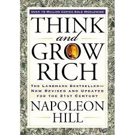

# Think and Grow Rich

## Desire
- For anyone to be successful, it is crucial that there exist within them the desire to be great or at least better than their current state.
- Whenever you focus on the lacking part, you attract more lack into your life subconsciously.
## Faith

- When a desire stems and attracts emotions that arise from deep within one’s belief, it attracts faith as well.
- Our beliefs hold so much power that they almost always come true so if you want a desire to become real.

## Auto Suggestion
- There is a strong reason why we do not believe in our own wishes and even though we want something, we do not believe we deserve it.
- In order to get rid of these beliefs, you need to meditate. Go somewhere quiet, relax your mind and repeat the beliefs you want to plant within you.

## Specialised Knowledge
- It is not acquiring knowledge but using it that makes one successful. The correct use of specialised knowledge can make one successful.

## Imagination
- When you use creative imagination to visualize and picture the fruits of your desires as a reality, they soon take form and in fact become a reality.

## Organised Planning
- In order to succeed, you need a concrete plan. Take your time to draft a plan and then write it down. Once you write it down, the chances of it becoming a reality increase.

## Decision
- People who keep forming and changing their decisions are barely ever able to achieve what they desire. 
- However, this it doesn’t mean a decision cannot be changed. However, a decision that is changed regularly is not much of a decision. Take strong and well thought-out decisions and then see them through to the end.

## Persistence
- Even though people fail, sometimes again and again, if they have a sound plan, and a strong desire to succeed as they persist they will become successful.

## Join a Master Mind
- It has been said that you will become the average of the five people you spend the most time with, when working to achieve your goals get around people that can inspire and lift you, those that can assist you with knowledge and can ultimately help propel you to success.

## Transmutation
- Transmute desires and passions that could be destructive if left unchecked within you, to an energy that can produce greatness.

## The Subconscious Mind
- We can control our subconscious mind this is best achieved through meditation. 

## The Brain
- When we repeat affirmations in our conscious mind while allowing ourselves to reach this state of mind through creative visualisations or imaginations, the pictures in our conscious mind are perceived as reality by our subconscious mind.
- In simple words, when we visualise something, our subconscious mind cannot differentiate between the scene being a figment of our imagination or actual reality.

## The Sixth Sense
- Intuition or gut feeling and it becomes more profound when you start meditating and tuning into your subconscious mind. Answers may come to us as hunches or gut feelings and this is why they must not be ignored.
